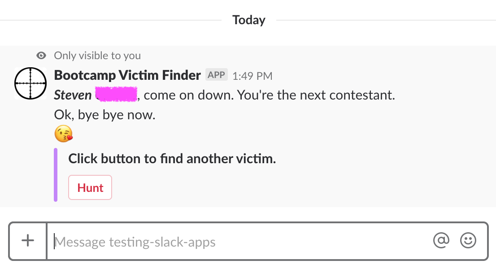

# README &middot; [](#license)  

This application was created to randomly select a student in class using a custom Slack slash command followed with the day of class. Chosen names will be removed from the database eliminating the possibilty of reselecting the same person. 

To initialize enter, `/victim reset`. This action will reset the database with _all_ names for _all_ classes. This should be done when the names have been exhausted or when the list needs to be rebuilt.

To choose a name enter, `/victim mw`, `/victim tth` or `/victim sat` and voilà!



## Table of Contents

- [Installation](#installation)
- [Implementation](#implementation)
- [Technology](#technology)
- [License](#license)

## Installation

To run locally download to your local machine and run the following commands:

```sh
$ npm install
$ nodemon index.js
```
Set up within Slack is still required (i.e. slash command, interactive message, db).

Note to self: command to view the log within Heroku is `heroku logs --source app`

<sub>Hosting on Heroku using the free tier may result in a slight response delay while the server spins up.</sub>

## Implementation

To use this within your own Slack workspace the following elements will require attention:

* Hosting. This application is hosted on Heroku using their [free tier](https://www.heroku.com/pricing). Continue using Heroku or any hosting service of your liking.
* mLab. Create a new deployement and Users then update the URI. 
* Class sessions. This app was built for two different classes (Monday/Wednesday & Tuesday/Thursday) that meet on Saturday in a combined session. If your schedule differs the following files will require session names (i.e. mw, tth, sat) to be updated, removed and/or added:
	* [Victim.js](./models/Victim.js). Update model names as needed. 
	* [anotherVictim.js](./options/anotherVictim.js). Update `callback_id` and exports names as needed. 
	* [mwClass.js](./options/mwClass.js). Update with the names of your students.
	* [tthClass.js](./options/tthClass.js). Update with the names of your students. If the file is to be removed or more is to be added, update the `victims.js` require statement as well. 

	 

	* [victims.js](./routes/api/victims.js). Be aware the use of mw, tth, and sat 
* Slack Integration. Create a [new app](https://api.slack.com/apps) and develop it in your Slack workspace.
	* Basic Information. Fill in the App Name, Short Description and Background Color.
	* Interactive Components. Turn this on. The Request URL should point back to your server with `/api/custom_name/survey` appended to the end. Swap `custom_name` with a name of your liking and update the route within `server.js`. 

		

	

	* Slash Commands. Create a new command using `/fist-to-five`. The Request URL should point back to your server but with `/api/custom_name` appended to the end. The custom name used here should be the same used in Interactive Components. Give your app a short description and any usage hint(s) (e.g. "Use `/fist-to-five reset` to reset app")
	* OAuth Tokens & Redirect URLs. Include the following Scopes: `channels:read`, `chat:write:bot`, `chat:write:user`, `groups:read`, `im:read`, & `mpim:read`, `commands`. Then click the Install App to Workspace button to reveal your OAuth access token.  
* Keys. Be sure to update the [keys](./config/keys_prod.js) accordingly and update the `slackTokenPath` within the routes file (i.e. slackTokenPath.*uclaSlackAccessToken*).

 

* `server.js`. Require your file into `server.js` and connect the route. Ignore/remove the code block inside the pink box. 


* `thumb_url`. Within the routes file look for `thumb_url`. There are 3 occurences but only 1 requires updating. If you choose to include a thumbnail image with the message confirmation, update the path. Otherwise it can removed.
* Custom emojis. The the hand emojis used can be found [here](./assets/hand/).

## Technology

Languages, libraries, applications and packages used:

- [JavaScript (ES6)](http://es6-features.org/)
- [Node.js](https://nodejs.org/)
- [Express.js](https://expressjs.com/)
- [Heroku](https://www.heroku.com/)
- [MongoDB (mLab)](https://mlab.com/)

## License

MIT License

Copyright (c) 2018 Mike Yamato

Permission is hereby granted, free of charge, to any person obtaining a copy
of this software and associated documentation files (the "Software"), to deal
in the Software without restriction, including without limitation the rights
to use, copy, modify, merge, publish, distribute, sublicense, and/or sell
copies of the Software, and to permit persons to whom the Software is
furnished to do so, subject to the following conditions:

The above copyright notice and this permission notice shall be included in all
copies or substantial portions of the Software.

THE SOFTWARE IS PROVIDED "AS IS", WITHOUT WARRANTY OF ANY KIND, EXPRESS OR
IMPLIED, INCLUDING BUT NOT LIMITED TO THE WARRANTIES OF MERCHANTABILITY,
FITNESS FOR A PARTICULAR PURPOSE AND NONINFRINGEMENT. IN NO EVENT SHALL THE
AUTHORS OR COPYRIGHT HOLDERS BE LIABLE FOR ANY CLAIM, DAMAGES OR OTHER
LIABILITY, WHETHER IN AN ACTION OF CONTRACT, TORT OR OTHERWISE, ARISING FROM,
OUT OF OR IN CONNECTION WITH THE SOFTWARE OR THE USE OR OTHER DEALINGS IN THE
SOFTWARE.